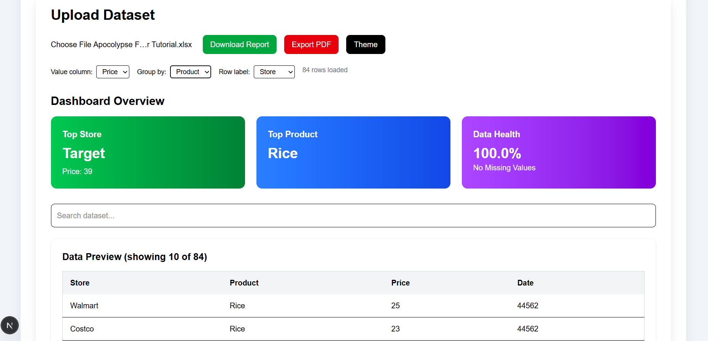
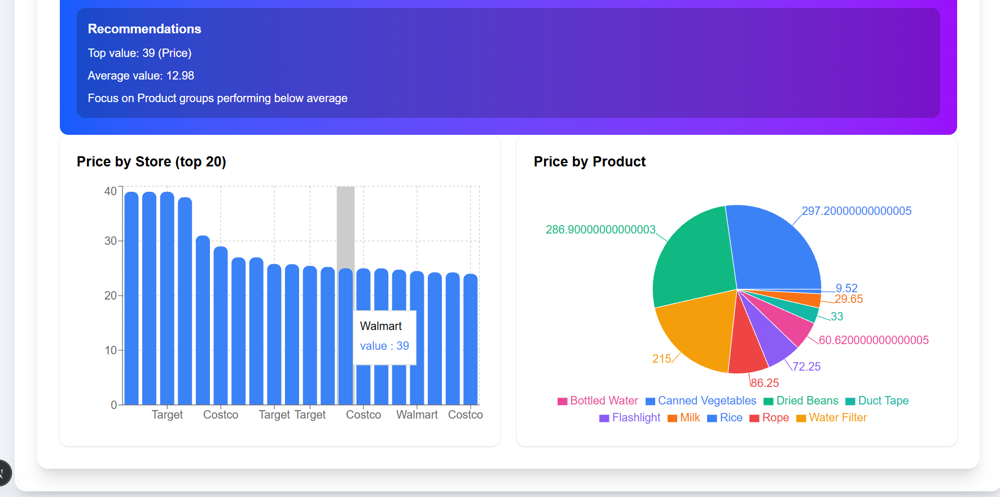

# AI Data Analyst Agent Dashboard

An AI-powered data analytics dashboard built with Next.js, TypeScript, Tailwind CSS, Recharts, and OpenAI.

## Features

• Upload CSV files

• Interactive KPI Dashboard

• Sales & Revenue Analytics

• Dynamic Charts & Visualizations

• AI Generated Insights

• PDF Export Functionality

• Responsive Design

## Tech Stack

- Next.js
- TypeScript
- Tailwind CSS
- Recharts
- OpenAI API
- PapaParse
- jsPDF
- html2canvas

## Screenshots

### Dashboard



### Charts & Analytics



### AI Insights


## Installation

```bash
git clone https://github.com/Rabeehkm6/ai-data-analyst-agent.git
cd ai-data-analyst-agent
npm install
npm run dev
